# Slash Command Manager Architecture

This document provides a comprehensive overview of the slash-command-manager architecture, its components, and how they interact.

## Overview

Slash Command Manager is a Python CLI tool for generating and managing slash commands across multiple AI coding assistants. The tool supports multiple AI agents and provides both local and GitHub-based prompt sources.

## High-Level Architecture

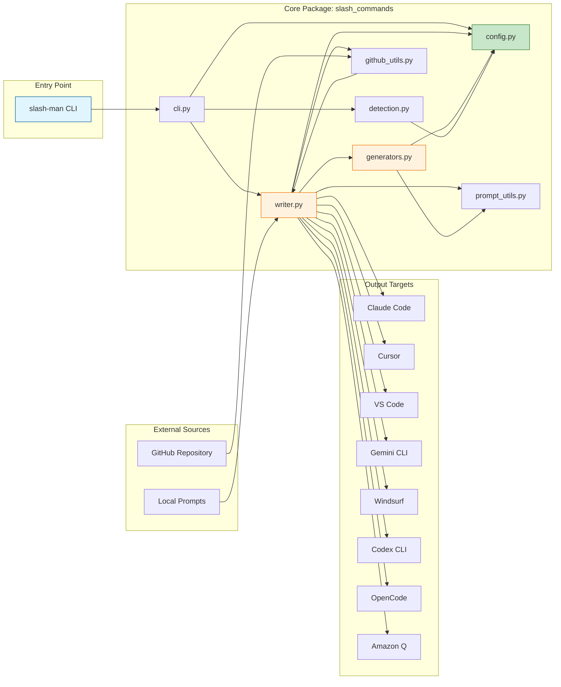

## Package Structure

The project is organized into two main packages:

```text
slash-command-manager/
├── slash_commands/          # Core CLI and generation logic
│   ├── __init__.py          # Package exports
│   ├── __version__.py       # Version management with git SHA
│   ├── cli.py               # Typer CLI application
│   ├── config.py            # Agent configurations
│   ├── detection.py         # Agent auto-detection
│   ├── generators.py        # Format-specific generators
│   ├── github_utils.py      # GitHub API integration
│   ├── prompt_utils.py      # Markdown prompt parsing utilities
│   └── writer.py            # Command generation orchestrator
├── scripts/
│   └── run_integration_tests.py  # Docker-based integration tests
└── tests/                   # Unit and integration tests
```

## Component Details

### CLI Module (`slash_commands/cli.py`)

The CLI is built with [Typer](https://typer.tiangolo.com/) and provides two
main commands:

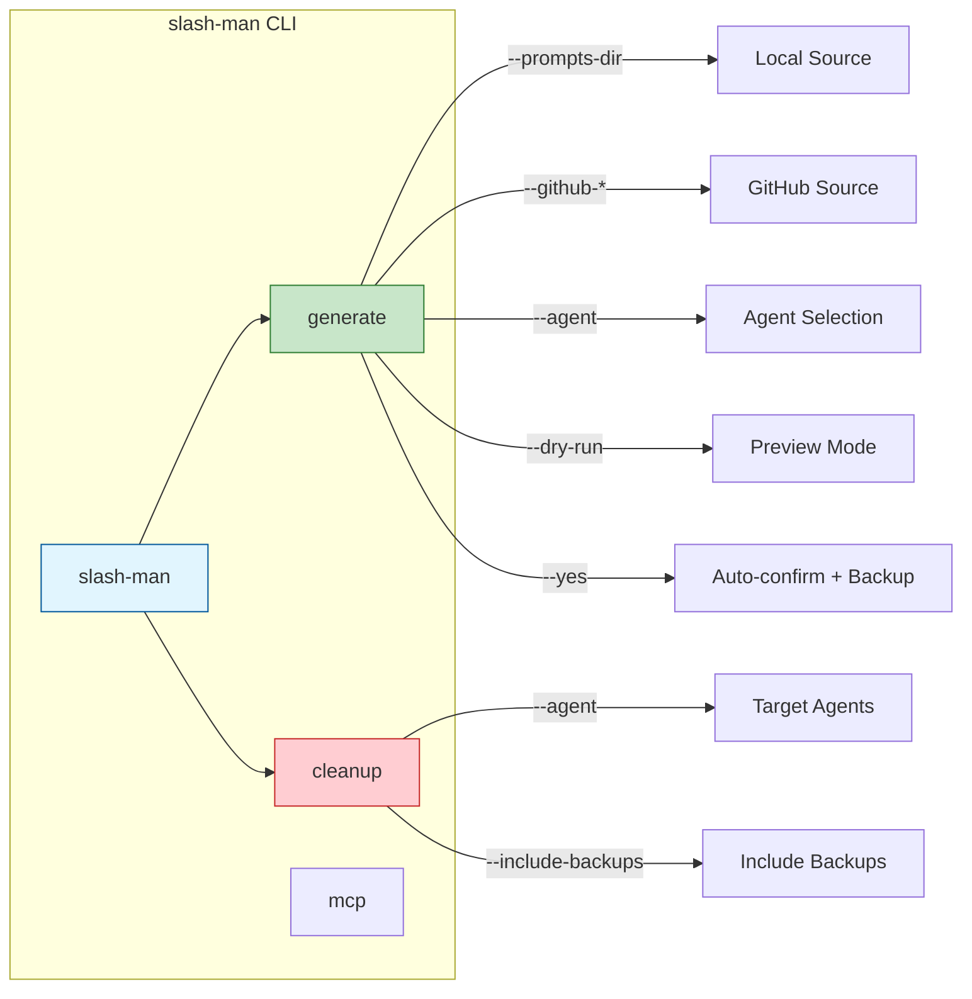

**Key Features:**

- **Version callback**: Displays version with git commit SHA
- **Project root detection**: Finds project root via `PROJECT_ROOT` env var, `.git`, `pyproject.toml`, or `setup.py`
- **Interactive agent selection**: Uses questionary for multi-select (all detected agents pre-selected)
- **Rich output**: Summary panels, tables, and tree views
- **Error handling**: Categorized exit codes (1=user, 2=validation, 3=I/O)
- **GitHub integration**: Supports downloading prompts from GitHub repositories (requires all three flags: `--github-repo`, `--github-branch`, `--github-path`)

### Configuration Module (`slash_commands/config.py`)

Defines the supported AI agents and their configuration:

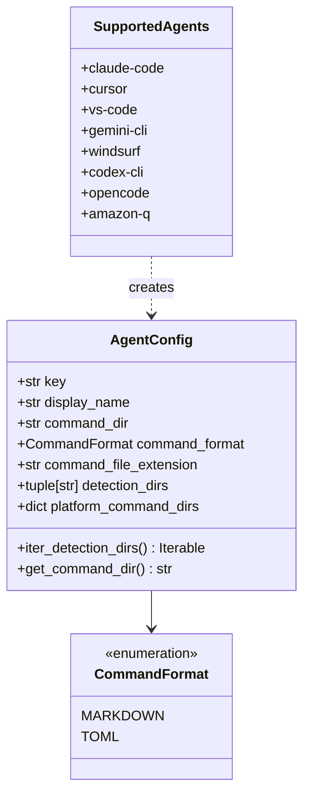

**Supported Agents:**

Agents are sorted alphabetically by key. Paths shown are relative to the user's home directory:

| Agent Key    | Format   | Command Directory (relative to ~)     | Extension    |
|--------------|----------|---------------------------------------|--------------|
| amazon-q     | Markdown | `.aws/amazonq/prompts`                | `.md`        |
| claude-code  | Markdown | `.claude/commands`                    | `.md`        |
| codex-cli    | Markdown | `.codex/prompts`                      | `.md`        |
| cursor       | Markdown | `.cursor/commands`                    | `.md`        |
| gemini-cli   | TOML     | `.gemini/commands`                    | `.toml`      |
| opencode     | Markdown | `.config/opencode/command`            | `.md`        |
| vs-code      | Markdown | Platform-specific (see below)         | `.prompt.md` |
| windsurf     | Markdown | `.codeium/windsurf/global_workflows`  | `.md`        |

**VS Code Platform Paths:**

These paths are relative to the user's home directory:

- **Linux**: `.config/Code/User/prompts` (resolves to `~/.config/Code/User/prompts`)
- **macOS**: `Library/Application Support/Code/User/prompts` (resolves to `~/Library/Application Support/Code/User/prompts`)
- **Windows**: `AppData/Roaming/Code/User/prompts` (resolves to `%APPDATA%/Code/User/prompts`)

### Detection Module (`slash_commands/detection.py`)

Auto-detects installed AI agents by checking for their configuration
directories:

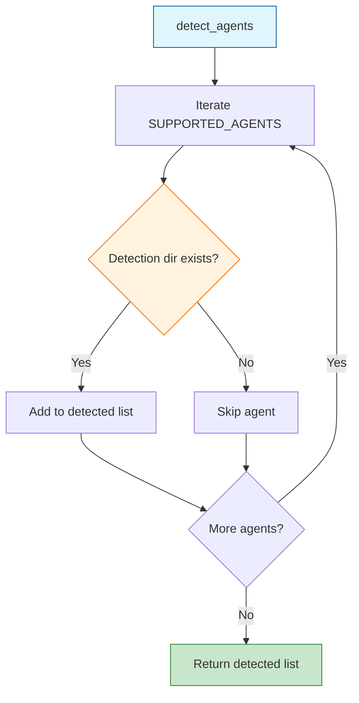

**Detection Strategy:**

1. Accepts a base path (default: user's home directory)
2. Iterates through all supported agents in alphabetical order (by key)
3. Checks if any detection directory exists for each agent
4. Returns list preserving the alphabetical ordering

### Writer Module (`slash_commands/writer.py`)

The central orchestrator for prompt loading and command generation:

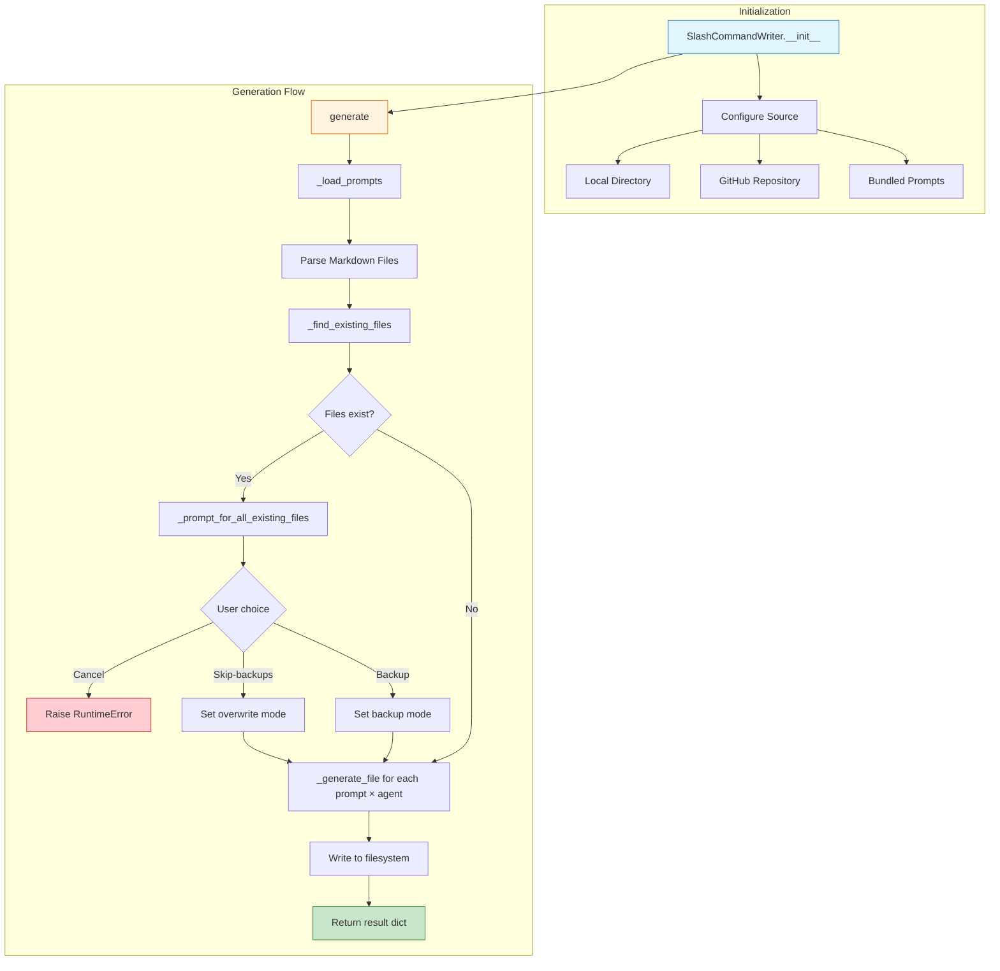

**Key Responsibilities:**

- **Prompt loading**: From local directory, GitHub, or bundled prompts
- **Conflict detection**: Finds existing files before generation
- **User interaction**: Single prompt for all conflicts (offers: cancel, backup, skip-backups)
- **Backup creation**: Timestamped backups before overwrite (format: `filename.ext.YYYYMMDD-HHMMSS.bak`)
- **File writing**: Creates directories and writes formatted content
- **Cleanup**: Finds and removes generated files (by checking metadata or backup pattern)

### Generators Module (`slash_commands/generators.py`)

Format-specific command file generators:

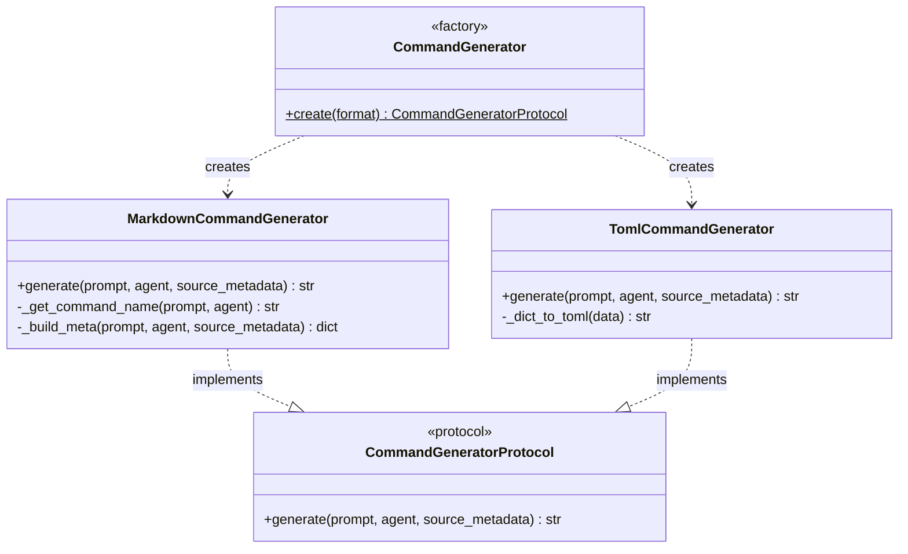

**Generation Process:**

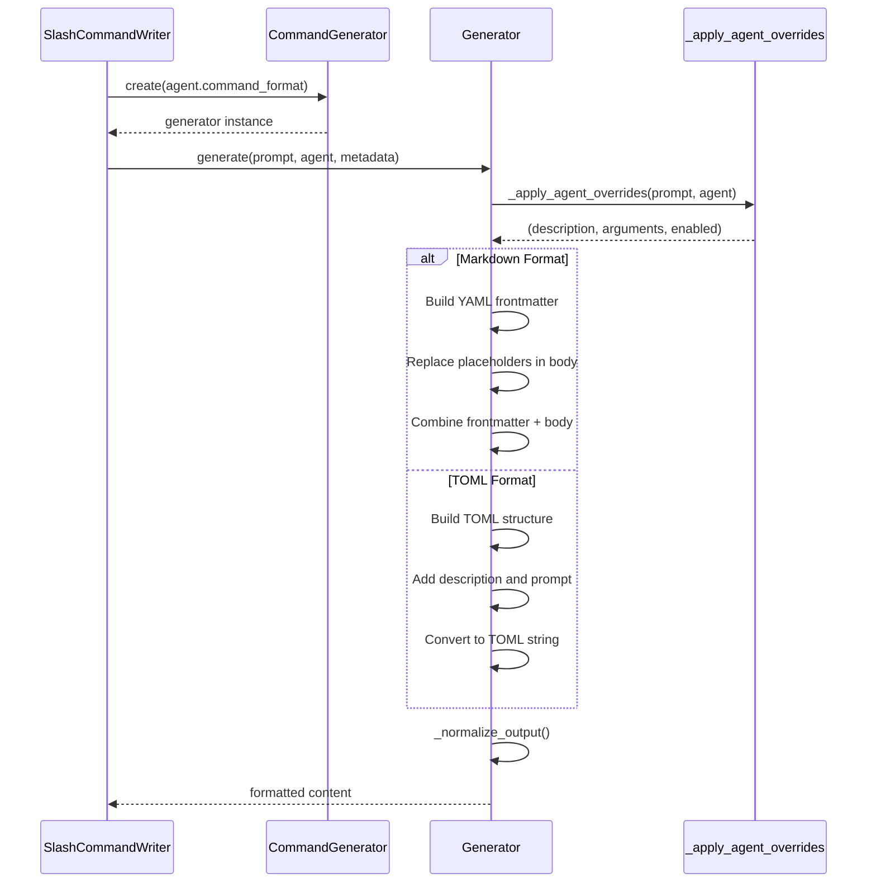

**Markdown Output Structure:**

```yaml
---
name: command-name
description: Command description
tags: [tag1, tag2]
enabled: true
arguments:
  - name: arg1
    description: Argument description
    required: true
meta:
  agent: cursor
  agent_display_name: Cursor
  command_dir: .cursor/commands
  command_format: markdown
  command_file_extension: .md
  source_prompt: original-prompt
  source_path: prompt.md
  version: 0.1.0
  updated_at: 2025-01-15T10:30:00+00:00
  source_type: local
  source_dir: /path/to/prompts
---

# Prompt Body

The actual prompt content goes here.
```

### GitHub Utils (`slash_commands/github_utils.py`)

Handles downloading prompts from GitHub repositories:

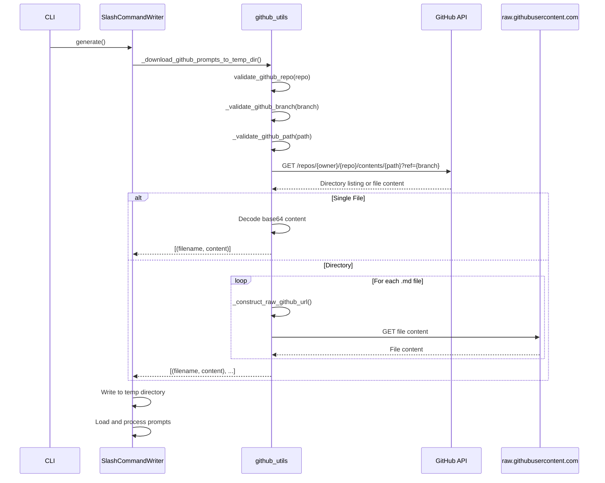

**Security Features:**

- Input validation for owner, repo, branch, and path
- Path traversal prevention (`..` detection)
- URL scheme validation (HTTPS only)
- Host validation (only `api.github.com` and `raw.githubusercontent.com`)
- Null byte rejection
- Whitelist character validation

### Prompt Utilities (`slash_commands/prompt_utils.py`)

Utility module for parsing markdown prompts with YAML frontmatter. Used by the writer and generators:

Parses markdown prompts with YAML frontmatter:

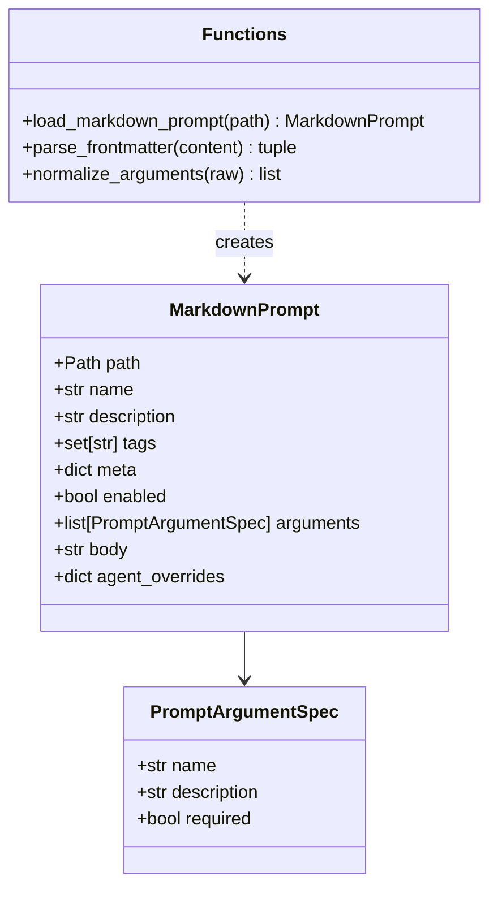

**Frontmatter Fields:**

- `name`: Command name (defaults to filename stem)
- `description`: Human-readable description
- `tags`: List of categorization tags
- `enabled`: Whether command is active (default: true)
- `arguments`: List of argument specifications
- `meta`: Additional metadata
- `agent_overrides`: Per-agent configuration overrides

### Version Management (`slash_commands/__version__.py`)

Provides version tracking with git commit SHA:

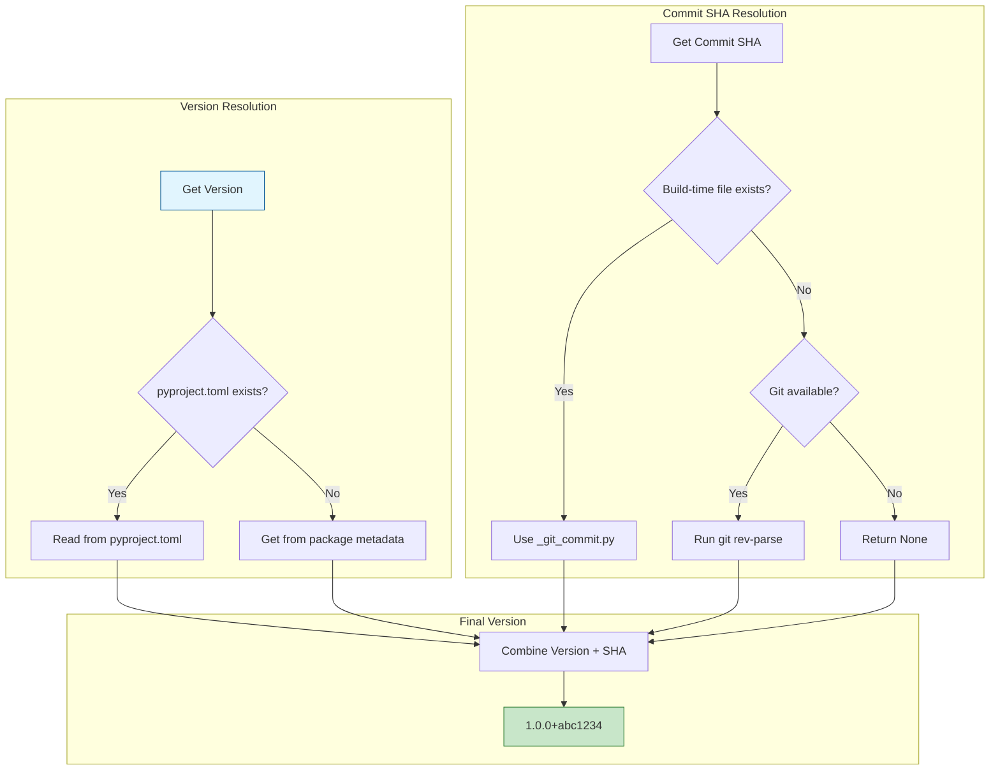

**Build Hook (`hatch_build.py`):**

During package building, the custom Hatch build hook:

1. Retrieves current git commit SHA
2. Creates `slash_commands/_git_commit.py` with embedded SHA
3. Includes file in the built package
4. Cleans up temporary file after build

## Data Flow

### Generate Command Flow

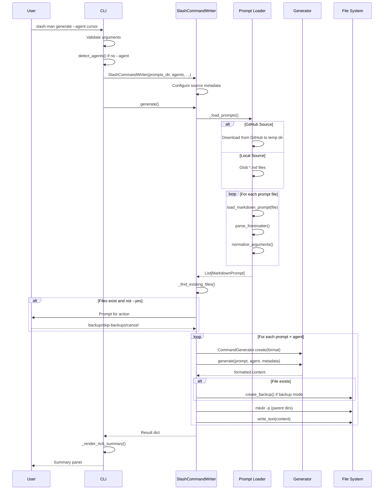

### Cleanup Command Flow

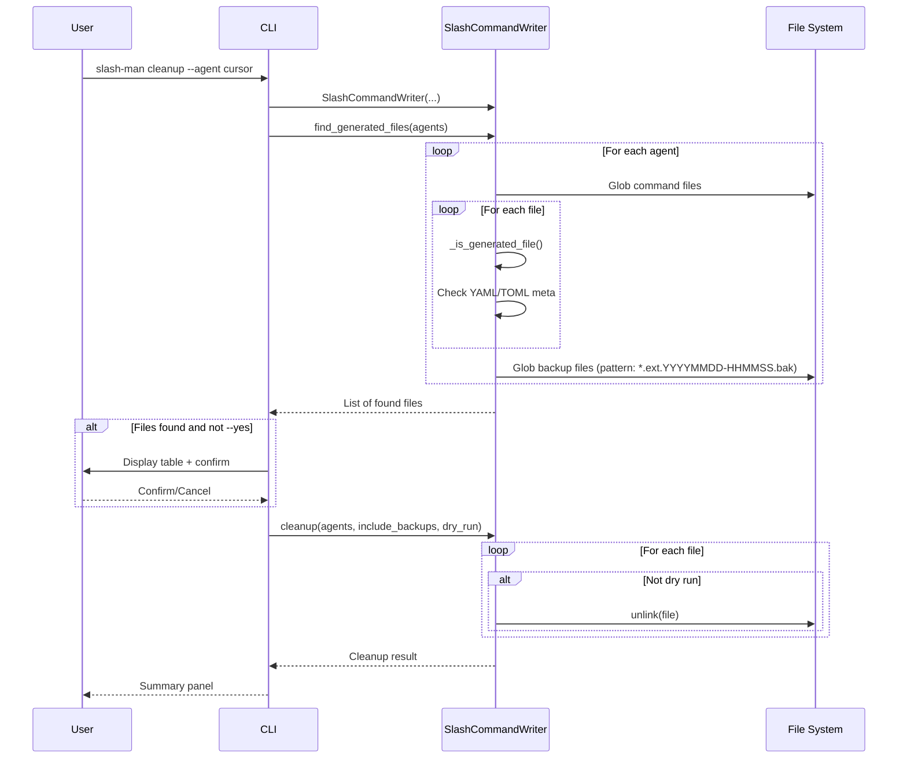

## Testing Architecture

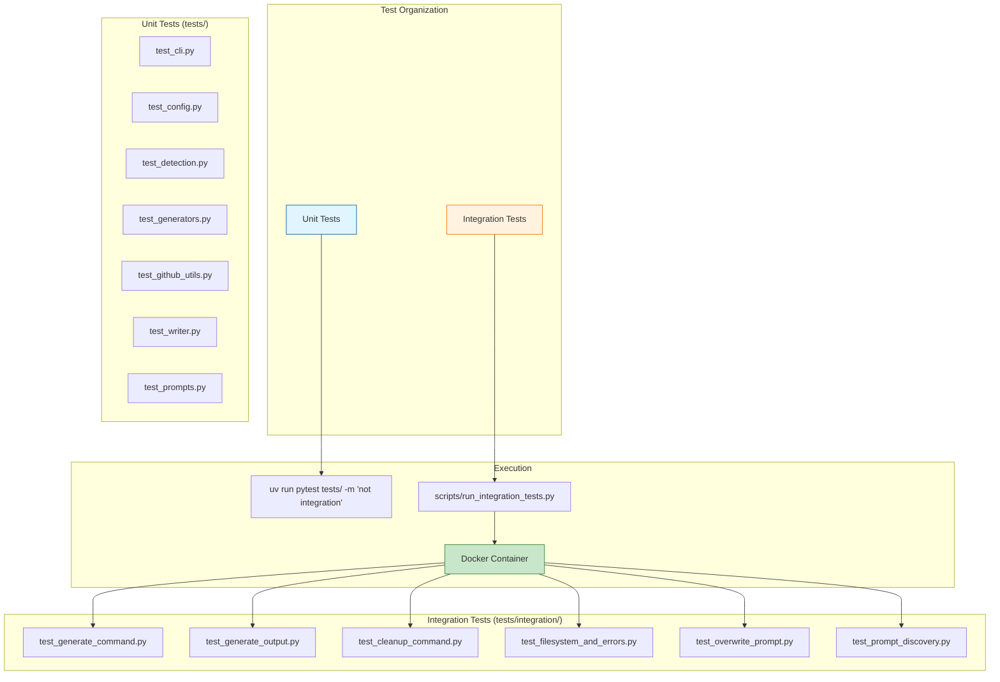

**Why Docker for Integration Tests:**

Integration tests write to the filesystem in agent-specific directories
(e.g., `~/.cursor/commands`). Running them in Docker:

1. Prevents overwriting user's actual prompt files
2. Provides isolated, repeatable test environment
3. Ensures tests don't interfere with each other

## Error Handling

The CLI uses categorized exit codes:

| Exit Code | Category     | Description                              |
|-----------|--------------|------------------------------------------|
| 0         | Success      | Operation completed successfully         |
| 1         | User Action  | User cancelled or no selection made      |
| 2         | Validation   | Invalid arguments or configuration       |
| 3         | I/O Error    | File system, network, or permission error|

## Configuration Hierarchy

### CLI Configuration

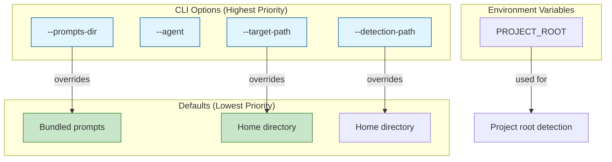

## Dependencies

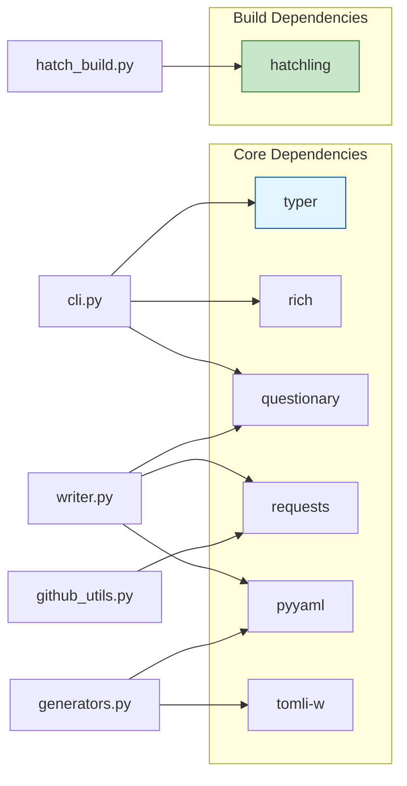

## Extension Points

### Adding a New Agent

1. Add configuration tuple to `_SUPPORTED_AGENT_DATA` in `config.py`:

   ```python
   (
       "new-agent",           # key
       "New Agent",           # display_name
       ".new-agent/commands", # command_dir
       CommandFormat.MARKDOWN,# command_format
       ".md",                 # command_file_extension
       (".new-agent",),       # detection_dirs
       None,                  # platform_command_dirs (or dict for platform-specific)
   ),
   ```

2. The agent will automatically be:
   - Available in `--agent` option
   - Detected if its directory exists
   - Listed in `--list-agents` output

### Adding a New Command Format

1. Add new value to `CommandFormat` enum in `config.py`
2. Create new generator class in `generators.py` implementing
   `CommandGeneratorProtocol`
3. Update `CommandGenerator.create()` factory method
4. Add corresponding `_is_generated_*` method in `writer.py`

## Related Documentation

- [Generator Documentation](slash-command-generator.md) - Detailed generator usage
- [Contributing Guidelines](../CONTRIBUTING.md) - Development guidelines
